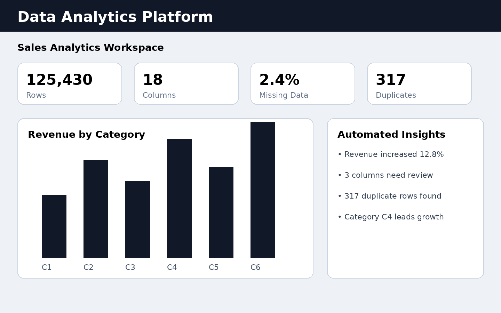
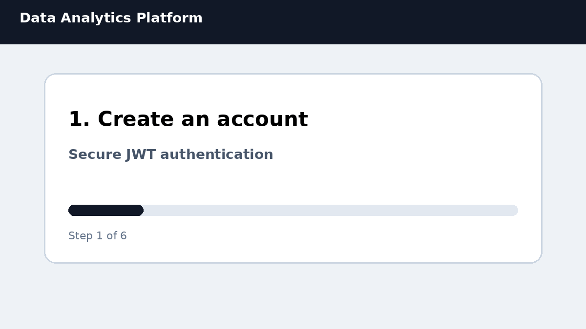
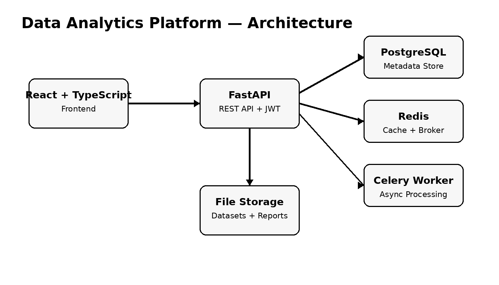

# Data Analytics Platform

A full-stack analytics product for data ingestion, profiling, transformation, visualization, automated insights, and PDF reporting.



## Product Demo



## Overview

The platform allows users to create projects, upload datasets, inspect data quality, apply ETL transformations, create dashboards, generate insights, and export reports.

## Main Features

- User registration and JWT authentication
- User-isolated projects
- CSV, Excel, JSON, and Parquet upload
- Paginated data preview
- Automated data profiling
- Missing-value, duplicate, correlation, and outlier detection
- Reusable ETL transformations
- Saved dashboards and charts
- KPI, bar, line, pie, histogram, scatter, and table visualizations
- Automated rule-based insights
- PDF report export
- PostgreSQL persistence
- Redis cache and task broker
- Celery background processing
- Alembic database migrations
- Docker Compose environment
- GitHub Actions CI
- Swagger/OpenAPI documentation

## Architecture



```text
React + TypeScript
        |
        v
FastAPI + JWT
   |        |
   |        +--> Redis Cache / Broker
   |                    |
   +--> PostgreSQL      +--> Celery Worker
   |
   +--> File Storage
   |
   +--> PDF Reports
```

## Technology Stack

**Backend:** Python, FastAPI, SQLAlchemy, Alembic, Pandas  
**Frontend:** React, TypeScript, Vite, Chart.js  
**Infrastructure:** PostgreSQL, Redis, Celery, Docker Compose  
**Quality:** Pytest, GitHub Actions, OpenAPI

## Running Locally

```bash
cp backend/.env.example backend/.env
docker compose up --build
```

Open:

- Frontend: `http://localhost:5173`
- Swagger: `http://localhost:8000/docs`
- Health check: `http://localhost:8000/health`

## End-to-End Workflow

1. Create an account.
2. Create a project.
3. Upload a dataset.
4. Run automated profiling.
5. Review quality issues and recommendations.
6. Apply data transformations.
7. Create dashboards and charts.
8. Generate insights.
9. Export a PDF report.

## Project Structure

```text
backend/
├── app/
│   ├── api/
│   ├── core/
│   ├── db/
│   ├── models/
│   ├── schemas/
│   ├── services/
│   └── tasks/
├── alembic/
├── tests/
└── Dockerfile

frontend/
├── src/
└── Dockerfile

docs/
└── assets/
    ├── architecture.png
    ├── dashboard-preview.png
    └── demo-flow.gif
```

## Portfolio Level

This repository is designed as a strong mid-level portfolio project. It demonstrates full-stack architecture, authentication, relational persistence, background jobs, caching, data processing, dashboards, tests, CI, containers, and technical documentation.

## Production Notes

This is a complete portfolio product, not an enterprise SaaS platform. A production-scale deployment would additionally require cloud object storage, full observability, load testing, audit logs, stronger tenant isolation, and high-availability infrastructure.

## License

MIT
