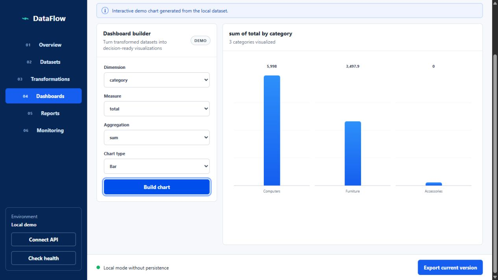

# DataFlow — Data Analytics Platform

[](https://github.com/MauricioTaguchi/data-analytics-platform/actions/workflows/ci.yml)
[](https://github.com/MauricioTaguchi/data-analytics-platform/actions/workflows/codeql.yml)
[](https://www.python.org/)
[](https://react.dev/)
[](LICENSE)

DataFlow is a production-minded analytics workspace that moves a dataset from ingestion to a decision-ready dashboard or PDF report. It makes data quality, background processing, version conflicts, lineage, and operational status visible instead of hiding them behind isolated API calls.



## Product workflow

1. Upload CSV, Excel, JSON, or Parquet with streamed size validation.
2. Import and validate the file in a Celery worker with progress and cancellation.
3. Inspect its schema, preview, missing values, duplicates, correlations, and outliers.
4. Preview a transformation and submit it with an expected version and idempotency key.
5. Track the background transformation, inspect lineage, and undo a completed version.
6. Build persisted charts and interactive dashboards.
7. Generate an auditable PDF report or export the current dataset version.

The React application includes a safe local demo, so a reviewer can evaluate the UX without credentials. Connecting the live API enables PostgreSQL persistence, Redis-backed coordination, rotating sessions, workers, dashboards, and reports.

## Engineering highlights

- Functional Overview, Datasets, Transformations, Dashboards, Reports, and Monitoring workspaces
- Responsive React + TypeScript interface with desktop and mobile Playwright journeys
- FastAPI routes with tenant isolation and consistent problem responses
- Chunked uploads and asynchronous import, profiling, transformation, and report generation
- Optimistic dataset versions, idempotency keys, explicit job states, compensating file cleanup, and undo
- Rotating refresh tokens with single-use server sessions and logout revocation
- Redis-backed cache, job ownership metadata, and multi-instance authentication rate limiting
- Bounded TTL fallback only in local/test environments; Redis is mandatory in production
- PostgreSQL, Alembic-only schema management, Celery, Redis, and versioned file storage
- Ruff, MyPy, ESLint, coverage thresholds, dependency review, Dependabot, and CodeQL
- Hourly orphan-file cleanup with a dedicated Celery scheduler

## Architecture

```text
React / TypeScript
        |
        v
FastAPI API ----------------------> PostgreSQL
   |                                     |
   +--> Redis cache / rate limits        +--> versions, jobs, lineage
   |          |
   |          +--> Celery worker / beat
   |                     |
   +---------------------+--------------> Versioned file storage
                              |
                              +---------> Dataset files and PDF reports
```

The `LocalStorage` boundary can be replaced by an S3-compatible adapter without changing transformation rules. See [Architecture](docs/ARCHITECTURE.md) and [Architecture decisions](docs/DECISIONS.md).

## Run locally

Requirements: Docker Desktop and Docker Compose.

```bash
cp backend/.env.example backend/.env
docker compose up --build
```

Open:

- Product: `http://localhost:5173`
- OpenAPI: `http://localhost:8000/docs`
- Readiness: `http://localhost:8000/health/ready`

The API container applies Alembic migrations before startup. The worker processes jobs, and the scheduler removes stale, unreferenced files.

## Test and verify

```bash
cd backend
python -m pip install -r requirements-dev.txt
ruff check app tests
mypy app/core app/services/storage_service.py app/schemas
pytest --cov=app --cov-fail-under=70

cd ../frontend
corepack enable
pnpm install --frozen-lockfile
pnpm typecheck
pnpm test
pnpm build
pnpm exec playwright install chromium
pnpm test:e2e
```

CI additionally runs ESLint, frontend coverage, PostgreSQL/Redis integration, migration validation, dependency audits, dependency review, and CodeQL.

## Core API workflow

- `POST /api/v1/datasets/project/{project_id}` — stream an upload and enqueue import
- `GET /api/v1/datasets/jobs/{task_id}` — inspect progress and result
- `DELETE /api/v1/datasets/jobs/{task_id}` — cancel an owned job
- `GET /api/v1/datasets/{dataset_id}/preview` — read a paginated preview
- `POST /api/v1/datasets/{dataset_id}/profile` — enqueue profiling
- `POST /api/v1/datasets/{dataset_id}/transform/preview` — enqueue a dry-run against an expected version
- `POST /api/v1/datasets/{dataset_id}/transform` — enqueue an idempotent transformation
- `POST /api/v1/datasets/{dataset_id}/transformations/undo` — restore the previous version
- `POST /api/v1/dashboards` and `/dashboards/{id}/charts` — create persisted visualizations
- `POST /api/v1/reports/project/{project_id}/dataset/{dataset_id}` — enqueue a PDF report

Authentication supports registration, login, automatic refresh-token rotation, and logout/revocation.

## Deliberate trade-offs

- Local versioned files keep the project easy to run; horizontally scaled production should use encrypted object storage.
- Pandas is appropriate for bounded portfolio workloads; the worker has row, time, memory, and lifecycle limits. Larger workloads belong in a distributed engine.
- The local demo is intentionally non-persistent and clearly labeled.
- Chart aggregation is synchronous today and bounded by the dataset limit; expensive analytical queries can move to a dedicated query worker later.

## Documentation

- [Architecture](docs/ARCHITECTURE.md)
- [API examples](docs/API_EXAMPLES.md)
- [Deployment guide](docs/DEPLOYMENT.md)
- [Security model](docs/SECURITY.md)
- [Architecture decisions](docs/DECISIONS.md)

## Roadmap

- S3/MinIO storage adapter with encrypted objects and signed downloads
- OpenTelemetry traces and centralized error monitoring
- Column-level validation contracts and scheduled quality rules
- Visual regression snapshots for dashboard states
- Distributed processing beyond single-node memory

## License

MIT
