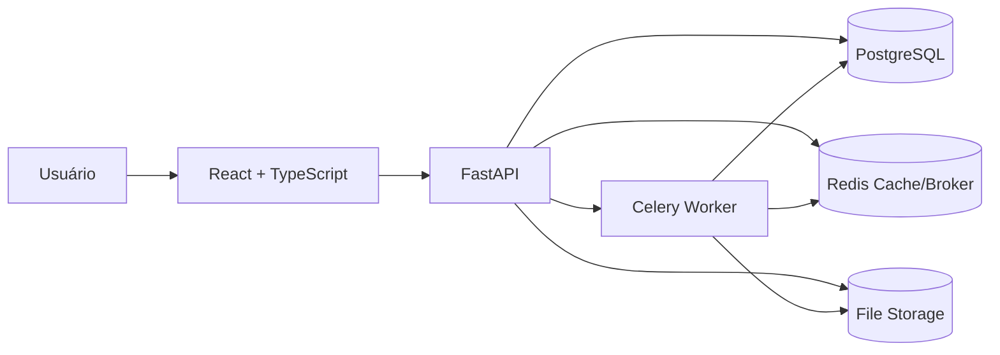

# Arquitetura

## Visão geral

## Responsabilidades

- **React:** fluxo de autenticação, projetos, upload e dashboard.
- **FastAPI:** autenticação, autorização, API, persistência e orquestração.
- **PostgreSQL:** usuários, projetos, datasets e histórico de transformações.
- **Redis:** cache do profiling e broker/backend do Celery.
- **Celery:** profiling assíncrono e preparado para jobs mais pesados.
- **Alembic:** versionamento do schema.
- **File Storage:** arquivos de datasets; S3/MinIO permanece como evolução.

## Decisões de engenharia

1. Profiling é assíncrono para não bloquear a API.
2. Resultados de profiling ficam em cache por 30 minutos.
3. Transformações invalidam o cache.
4. Migrações rodam antes da API subir no Docker Compose.
5. O acesso a projetos e datasets é limitado ao proprietário.
