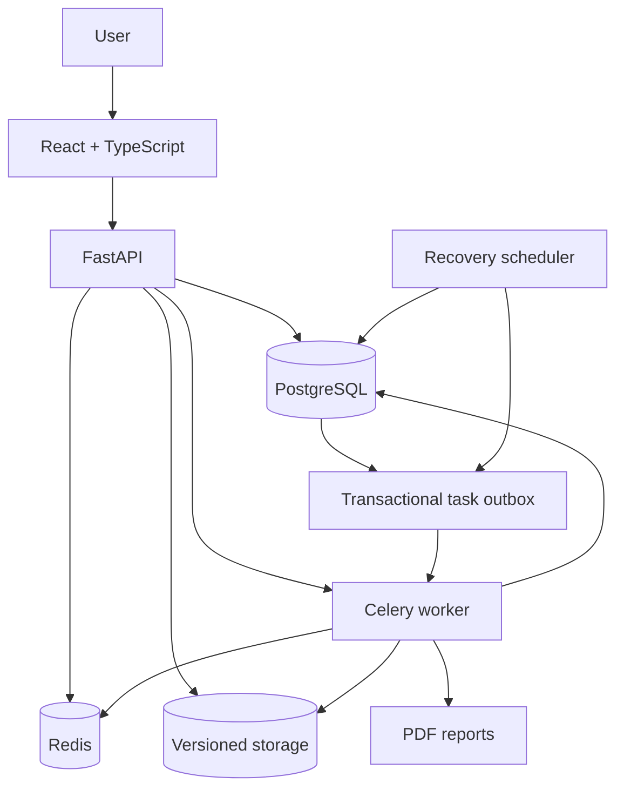
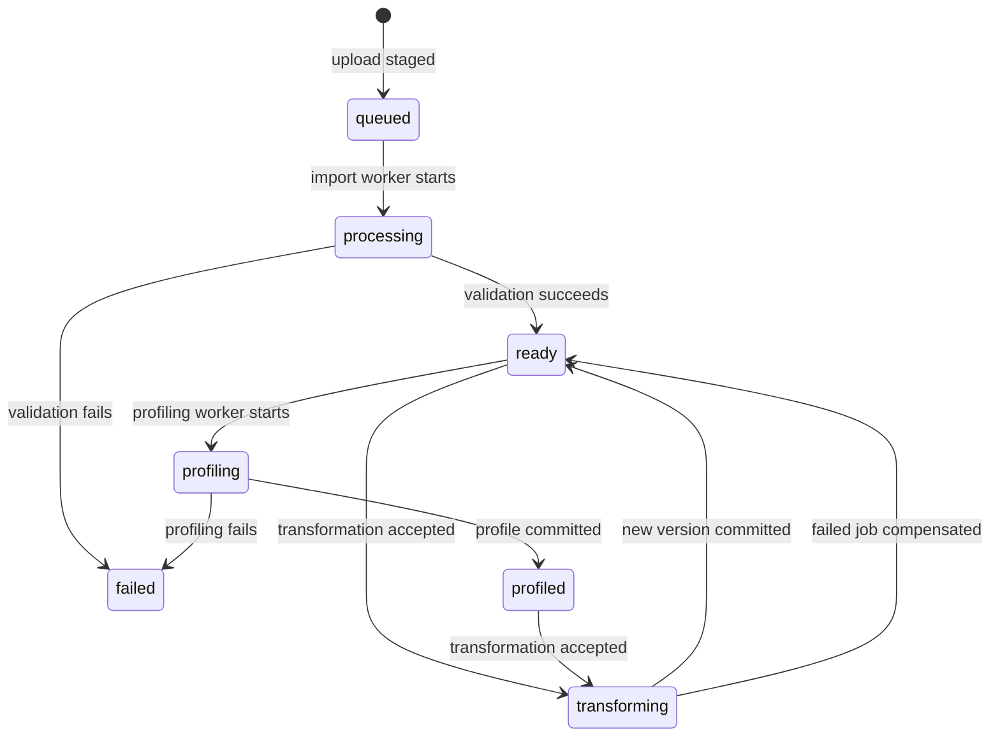

# Architecture

## System overview

## Responsibilities

- **React:** authentication lifecycle, dataset workflows, dashboards, reports, and job monitoring.
- **FastAPI:** authorization, request validation, orchestration, and stable API contracts.
- **PostgreSQL:** users, refresh sessions, projects, datasets, transformations, dashboards, charts, reports, durable jobs, and the transactional task outbox.
- **Redis:** shared cache, rate-limit counters, Celery broker, and transient task results.
- **Celery worker:** import validation, profiling, transformations, and PDF generation outside API requests.
- **Recovery scheduler:** a standalone `python -m app.scheduler` process that directly reconciles database leases, dispatches the outbox, and runs storage/session/history cleanup. Its execution does not depend on receiving a Celery task through Redis.
- **Alembic:** the only production schema-management path.
- **Versioned storage:** immutable dataset outputs and generated reports behind a replaceable boundary.

## Dataset state flow

## Consistency model

Every transformation carries the dataset revision observed by the client. A conditional database update advances that revision only when both the revision and active file pointer still match. Undo advances the revision too, so returning to older content cannot make a stale mutation current again. Output paths are unique to each attempt and registered durably before writing. A short final transaction revalidates the account quota, job lease, dataset revision, and artifact reservation before publishing the new pointer. Job success and artifact publication commit with the domain state. Filesystem writes and PostgreSQL do not share an atomic commit: unresolved attempts and terminal cleanup requests remain in the artifact registry for idempotent collection, including when the commit acknowledgement is lost.

Domain state, the durable job record, and its outbox event are committed in one database transaction. Immediate dispatch is attempted after commit. When the broker is unavailable or the API process exits at the hand-off boundary, the independent scheduler retries the persisted event with a claim token, a lease, and bounded backoff. A separate scheduler activity recovers expired worker leases and missing deliveries through PostgreSQL, even while Redis is down. Retry budgets bound repeated execution. Publication acknowledgement does not prove task execution; durable job state remains authoritative.

Dispatch, job reconciliation, and periodic cleanup execute in separate scheduler threads with separate database sessions. A blocked broker call cannot occupy the reconciliation thread. Dependency failures are logged and retried; stalled activities exceed a watchdog deadline and terminate the scheduler so its process supervisor can restart it. Outbox and job claims are fenced in PostgreSQL, so overlapping scheduler instances do not require a Redis leader lock. Storage cleanup replicas still require access to the same versioned storage.

Import is the one intentional two-phase admission path. An outer ASGI guard checks declared and received request bytes, shared upload rate limits, a read-only active-job precheck, and a process-local receive slot while FastAPI parses multipart content. Once that bounded parser step finishes, the route reserves an owned job ID before copying and validating the `UploadFile` spool into versioned storage, attaching the dataset, and committing its outbox event. The locked reservation remains authoritative because the precheck is intentionally race-prone. Cancellation and monitoring can observe the storage-staging phase, but not the earlier network receive/parser phase. A failed or interrupted staging attempt leaves a terminal job record and no referenced dataset file.

An idempotency key is unique per dataset and user. Repeated submissions return the existing transformation only when operation, parameters, and expected version match; reusing the key for a different request is rejected.

## Production-minded runtime invariants

1. API startup never creates tables; migrations run through Alembic.
2. Redis failures are visible in production and never silently switch to process-local state.
3. Project, dataset, dashboard, report, and job access is restricted to the owner.
4. Per-account job/storage quotas, upload rate limits, archive/output-expansion checks, result-size limits, free-disk admission, and worker time, memory, task-count, row-count, column-count, and file-size limits bound resource consumption.
5. Non-upload request bodies are bounded independently from multipart uploads before framework parsing; declared and chunked transfers follow the same byte ceiling.
6. Refresh tokens are single-use and are revoked during rotation or logout.
7. A committed background operation always has a durable dispatch record; broker publication is never the sole record of intent.

These invariants describe application behavior enforced by the current implementation. They do not imply high availability, disaster recovery, formal service objectives, or independent security assurance. See [Known limitations](LIMITATIONS.md).
