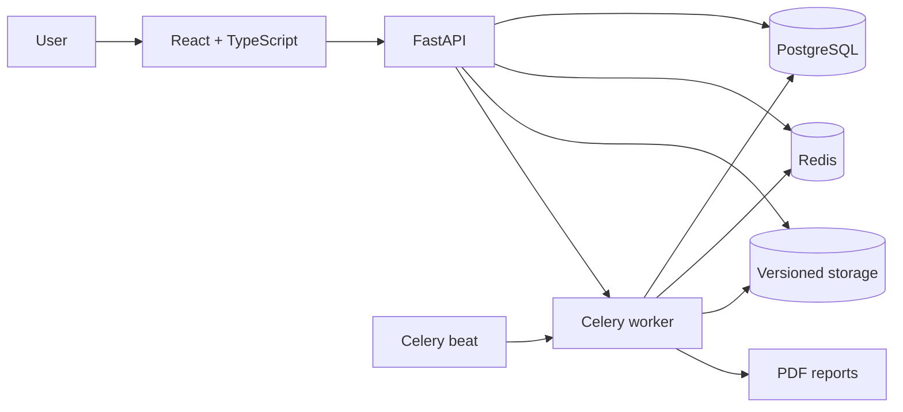
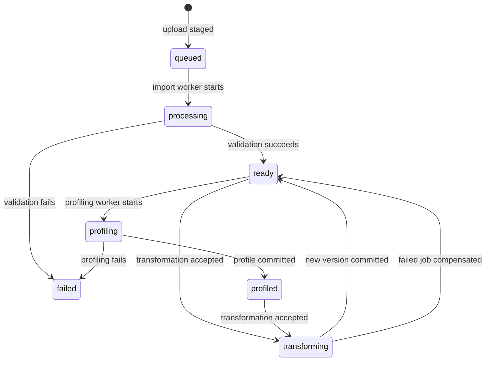

# Architecture

## System overview

## Responsibilities

- **React:** authentication lifecycle, dataset workflows, dashboards, reports, and job monitoring.
- **FastAPI:** authorization, request validation, orchestration, and stable API contracts.
- **PostgreSQL:** users, refresh sessions, projects, datasets, transformations, dashboards, charts, and reports.
- **Redis:** shared cache, rate-limit counters, job metadata, Celery broker, and task results.
- **Celery worker:** import validation, profiling, transformations, and PDF generation outside API requests.
- **Celery beat:** scheduled orphan-file cleanup.
- **Alembic:** the only production schema-management path.
- **Versioned storage:** immutable dataset outputs and generated reports behind a replaceable boundary.

## Dataset state flow

## Consistency model

Every transformation carries the dataset version observed by the client. A conditional database update advances that version only when both the version and active file pointer still match. Output is first written to a temporary path and atomically renamed. Normal failures remove temporary/final output and mark the job as failed; a scheduled sweep removes old unreferenced files after a grace period.

An idempotency key is unique per dataset and user. Repeated submissions return the existing transformation rather than duplicating work.

## Production invariants

1. API startup never creates tables; migrations run through Alembic.
2. Redis failures are visible in production and never silently switch to process-local state.
3. Project, dataset, dashboard, report, and job access is restricted to the owner.
4. Worker time, memory, task-count, row-count, and file-size limits bound resource consumption.
5. Refresh tokens are single-use and are revoked during rotation or logout.
