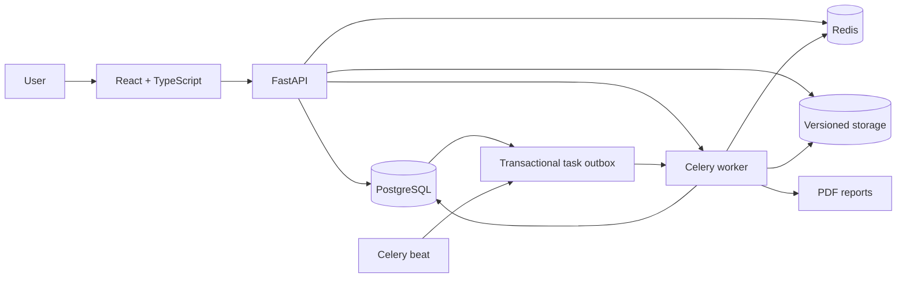
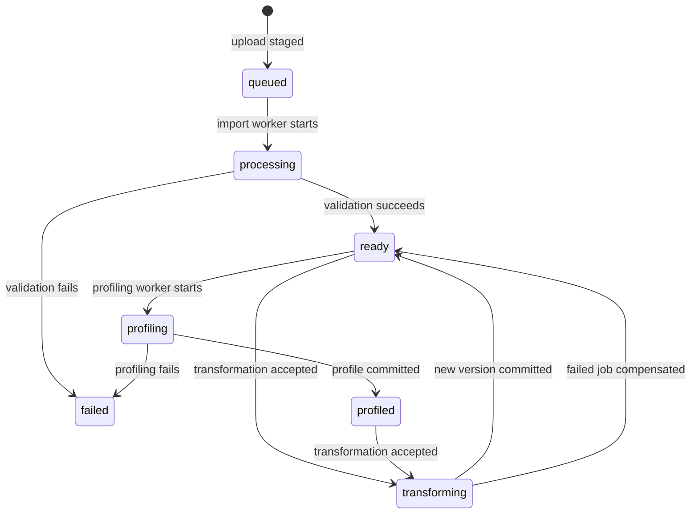

# Architecture

## System overview

## Responsibilities

- **React:** authentication lifecycle, dataset workflows, dashboards, reports, and job monitoring.
- **FastAPI:** authorization, request validation, orchestration, and stable API contracts.
- **PostgreSQL:** users, refresh sessions, projects, datasets, transformations, dashboards, charts, reports, durable jobs, and the transactional task outbox.
- **Redis:** shared cache, rate-limit counters, Celery broker, and transient task results.
- **Celery worker:** import validation, profiling, transformations, and PDF generation outside API requests.
- **Celery beat:** scheduled outbox dispatch, expired-session cleanup, and orphan-file reconciliation.
- **Alembic:** the only production schema-management path.
- **Versioned storage:** immutable dataset outputs and generated reports behind a replaceable boundary.

## Dataset state flow

## Consistency model

Every transformation carries the dataset version observed by the client. A conditional database update advances that version only when both the version and active file pointer still match. Output is first written outside a database transaction through a capacity-guarded temporary stream that enforces the expanded-size, quota snapshot, and free-disk limits before each write. A short final transaction then locks the account and durable job, revalidates the authoritative quota/version/lease, atomically renames the file, and advances the pointer. Normal failures remove temporary/final output and mark the job and domain state consistently; a scheduled sweep removes old unreferenced files after a grace period.

Domain state, the durable job record, and its outbox event are committed in one database transaction. Immediate dispatch is attempted after commit. When the broker is unavailable or the API process exits at the hand-off boundary, Celery beat retries the persisted event with a claim lease and bounded exponential backoff. Workers use their own renewable execution lease so late delivery and worker loss remain recoverable without applying a completed task twice.

Import is the one intentional two-phase admission path. An outer ASGI guard checks declared and received request bytes, shared upload rate limits, a read-only active-job precheck, and a process-local receive slot while FastAPI parses multipart content. Once that bounded parser step finishes, the route reserves an owned job ID before copying and validating the `UploadFile` spool into versioned storage, attaching the dataset, and committing its outbox event. The locked reservation remains authoritative because the precheck is intentionally race-prone. Cancellation and monitoring can observe the storage-staging phase, but not the earlier network receive/parser phase. A failed or interrupted staging attempt leaves a terminal job record and no referenced dataset file.

An idempotency key is unique per dataset and user. Repeated submissions return the existing transformation only when operation, parameters, and expected version match; reusing the key for a different request is rejected.

## Production-minded runtime invariants

1. API startup never creates tables; migrations run through Alembic.
2. Redis failures are visible in production and never silently switch to process-local state.
3. Project, dataset, dashboard, report, and job access is restricted to the owner.
4. Per-account job/storage quotas, upload rate limits, archive/output-expansion checks, result-size limits, free-disk admission, and worker time, memory, task-count, row-count, column-count, and file-size limits bound resource consumption.
5. Non-upload request bodies are bounded independently from multipart uploads before framework parsing; declared and chunked transfers follow the same byte ceiling.
6. Refresh tokens are single-use and are revoked during rotation or logout.
7. A committed background operation always has a durable dispatch record; broker publication is never the sole record of intent.

These invariants describe application behavior enforced by the current implementation. They do not imply high availability, disaster recovery, formal service objectives, or independent security assurance. See [Known limitations](LIMITATIONS.md).
